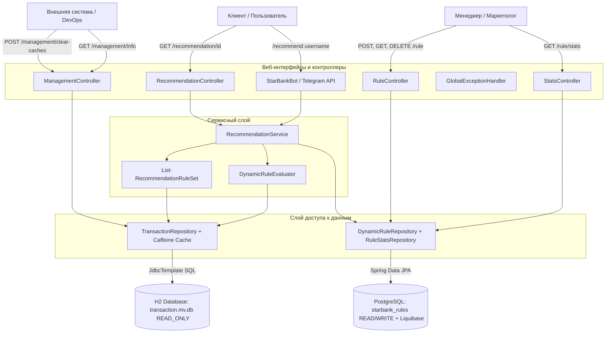
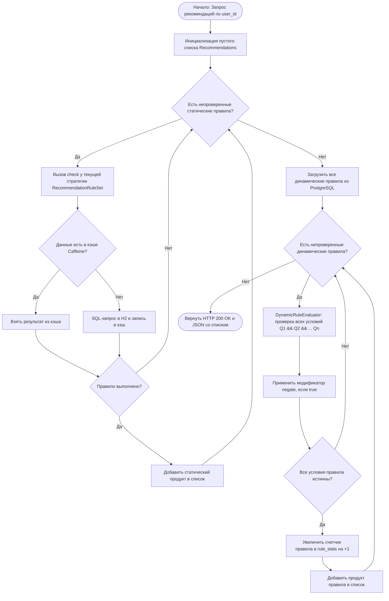

# 🏛️ Архитектура приложения и диаграммы процессов

## 📊 1. Диаграмма компонентов (Component Diagram)

```mermaid
graph TD
    User[Клиент / Пользователь]
    Manager[Менеджер / Маркетолог]
    Sys[Внешняя система / DevOps]

    subgraph Web_Layer [Веб-интерфейсы и контроллеры]
        Controller[RecommendationController]
        RuleController[RuleController]
        StatsController[StatsController]
        MgmtController[ManagementController]
        Advice[GlobalExceptionHandler]
        Bot[StarBankBot / Telegram API]
    end

    subgraph Service_Layer [Сервисный слой]
        Service[RecommendationService]
        Evaluator[DynamicRuleEvaluator]
        StaticRules[List-RecommendationRuleSet]
    end

    subgraph Data_Layer [Слой доступа к данным]
        Repo[TransactionRepository + Caffeine Cache]
        JPA[DynamicRuleRepository + RuleStatsRepository]
    end

    H2[(H2 Database: transaction.mv.db <br> READ_ONLY)]
    Postgres[(PostgreSQL: starbank_rules <br> READ/WRITE + Liquibase)]

    User -->|GET /recommendation/id| Controller
    User -->|/recommend username| Bot
    Manager -->|POST, GET, DELETE /rule| RuleController
    Manager -->|GET /rule/stats| StatsController
    Sys -->|POST /management/clear-caches| MgmtController
    Sys -->|GET /management/info| MgmtController

    Controller & Bot --> Service
    RuleController & StatsController --> JPA
    MgmtController --> Repo

    Service --> StaticRules
    Service --> Evaluator
    Evaluator --> Repo
    StaticRules --> Repo
    Service --> JPA

    Repo -->|JdbcTemplate SQL| H2
    JPA -->|Spring Data JPA| Postgres
```

---

## 🚦 2. Диаграмма деятельности алгоритма выдачи (Activity Diagram)

```mermaid
graph TD
    Start([Начало: Запрос рекомендаций по user_id]) --> Init[Инициализация пустого списка Recommendations]
    Init --> StaticLoop{Есть непроверенные статические правила?}

    StaticLoop -->|Да| CheckStatic[Вызов check у текущей стратегии RecommendationRuleSet]
    CheckStatic --> Cache1{Данные есть в кэше Caffeine?}
    Cache1 -->|Да| GetCache1[Взять результат из кэша]
    Cache1 -->|Нет| QueryH2_1[SQL-запрос в H2 и запись в кэш]
    GetCache1 & QueryH2_1 --> StaticMatch{Правило выполнено?}
    StaticMatch -->|Да| AddStatic[Добавить статический продукт в список]
    StaticMatch -->|Нет| StaticLoop
    AddStatic --> StaticLoop

    StaticLoop -->|Нет| LoadDynamic[Загрузить все динамические правила из PostgreSQL]
    LoadDynamic --> DynamicLoop{Есть непроверенные динамические правила?}

    DynamicLoop -->|Да| EvalRule[DynamicRuleEvaluator: проверка всех условий Q1 && Q2 && ... Qn]
    EvalRule --> ApplyNegate[Применить модификатор negate, если true]
    ApplyNegate --> DynamicMatch{Все условия правила истинны?}
    DynamicMatch -->|Да| IncStat[Увеличить счетчик правила в rule_stats на +1]
    IncStat --> AddDynamic[Добавить продукт правила в список]
    DynamicMatch -->|Нет| DynamicLoop
    AddDynamic --> DynamicLoop

    DynamicLoop -->|Нет| ReturnRes([Вернуть HTTP 200 OK и JSON со списком])
```